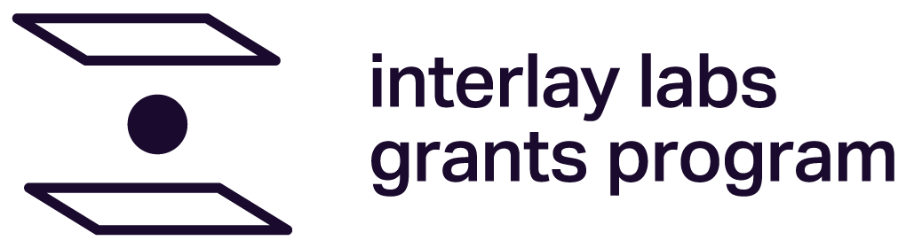

# Usage guidelines for the Interlay Labs Grants Program badge

 
**Once a project's first milestone has been accepted**, we intend to help teams acknowledge their grant publicly while observing the foundation’s guidelines.

To that end, we’ve created a badge for grant recipients. This is available for download in four formats under [Interlay Labs Grants Program Badges](https://github.com/interlay/Grants-Program/blob/878d88c923dc703ced6591d3a5d9a4f1ad0f68df/src/Interlay-badges.zip?raw=true).

*Before you begin using the badge, please note the following points:*

- Use of the Grants Program badge is reserved for only grant recipent projects.
- Grants are awarded **for specific projects**, not to teams in general as a blanket endorsement.
- Interlay and its grants program **don’t broker partnerships or joint ventures**, or cosign wholesale any external team’s work. Bearing that in mind, **the badge should only be displayed in project-specific contexts.**
- Please **do**: display the badge
  - in a GitHub repository that contains code connected with the grant project,
  - on any project-specific webpage **that specifically concerns the deliverables completed as part of the grant**, or
  - when appropriate, in a tweet or blog post announcing your grant in a project-specific context.
- Please **don’t**:
  - display the badge on your team or project's landing page,
  - use the badge before your first milestone has been accepted,
  - add it to any social media profiles, or
  - use it in any other context that could misrepresent your relationship with the Interlay Labs Grants Program.

Also, please don't use the **name or logo of the  Interlay Labs Grants Program ** in any context that could misrepresent your relationship with Interlay. Infringement of these guidelines can result in an immediate annulment of the grant.

In case of any questions, please don’t hesitate to reach out to us at grants@interlay.io
